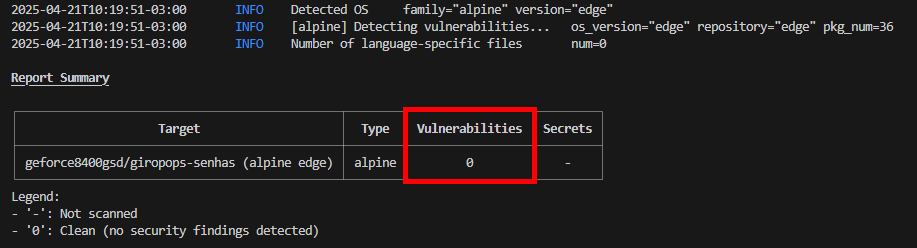

# Projeto final do Programa Intensivo em Containers e Kubernetes | PICK LINUXtips 

O Projeto final consite na resolução do desafio PICK 2024_01 proposto pelo [@Badtuxx](https://github.com/badtuxx). O desafio consiste em um projeto prático de DevOps focado na aplicação de gestão de senhas [Giropops-Senhas](https://github.com/badtuxx/giropops-senhas). O projeto exige Stacks com ferramentas de containerização, orquestração, segurança e monitoramento, com foco em ambientes seguros, CI/CD,  automatizados e observáveis com alta disponibilidade.

**Objetivos principais:**

  Containerizar a aplicação com Docker e publicá-la.

  Orquestrar o deployment com Kubernetes e expor o serviço com Ingress.

  Automatizar o deploy utilizando Helm Charts.

  Implementar segurança de runtime com Kyverno e Cosign (assinatura de imagens).

  Monitorar métricas com Prometheus e configurar alertas.

  Distribuir pacotes da aplicação utilizando Melange e Apko.

  Implementar CI/CD para build e publicação dos pacotes em múltiplos ambientes

### Tecnologias envolvidas no projeto:


------------------------------------


## INFRAESTRUTURA ON PREMISE

No meu projeto, o Cluster irá rodar localmente em uma VM no Hyper-V.

# Especificações:

|       VM       |       CPU        |     RAM     |     OS      |  CLUSTER KUBERNETES  |
|----------------|------------------|-------------|-------------|----------------------|
|     Hyper-V    | Xeon 2360 4 Core |     17GB    | Rocky Linux |         KinD         |


# PROVISIONANDO SERVER PARA O CLUSTER.

**Rede**:

Irei configurar o IP 192.168.1.81/24 de forma estática na subrede 192.168.1.x junto com meu gateway, o DNS será do Google (8.8.8.8).
```
nmcli con mod eth0 ipv4.addresses 192.168.1.81/24
nmcli con mod eth0 ipv4.gateway 192.168.1.254
nmcli con mod eth0 ipv4.dns 8.8.8.8
nmcli con mod eth0 ipv4.method manual
```

Reiniciando a conexão para aplicar as alterações.
````
nmcli con down eth0 && nmcli con up eth0
````

Visualizando:

*ip a show eth0
nmcli dev show eth0*


Rede Configurada. -----------------------------------------------------------------


Atualizando o OS.
```
dnf update -y
```
Instale o Git:
```
sudo dnf install -y git
```


# VM atualizada e Git instalado, agora vamos para o Docker.


### Docker
Docker é uma plataforma que facilita criar, empacotar e rodar aplicações dentro de containers. Um container é um ambiente leve, portátil e isolado que roda uma aplicação e suas dependências (bibliotecas, arquivos de configuração, etc.), tudo empacotado junto.

```
sudo dnf config-manager --add-repo https://download.docker.com/linux/centos/docker-ce.repo
```
### Conterinerd
Containerd é o runtime de containers — ou seja, é o motor que roda containers 
```
sudo dnf install -y docker-ce docker-ce-cli containerd.io
```

Habilitei o service do docker na inicialização.
```
sudo systemctl enable docker --now
```
Verificando a instalação
````
docker --version
````


### Kubectl
kubectl é a ferramenta de linha de comando usada para interagir com um cluster Kubernetes. Quando você executa um comando, ele envia uma requisição para a API Server, que coordena as ações necessárias no cluster.


Instalando a versão stable do kubectl, dando permissão para execução e movendo a saída para o diretório */usr/local/bin/*
```
curl -LO "https://dl.k8s.io/release/$(curl -L -s https://dl.k8s.io/release/stable.txt)/bin/linux/amd64/kubectl"
chmod +x kubectl
sudo mv kubectl /usr/local/bin/
```

Verifique a instalação
````
kubectl version --client
````


# KinD - Kubernetes in Docker
Kind é uma ferramenta que permite criar clusters Kubernetes locais usando containers Docker como nós do cluster.

Baixaxando o kind, dando permissão de execução e movendo para o diretório */usr/local/bin/kind*
```
curl -Lo ./kind https://kind.sigs.k8s.io/dl/v0.22.0/kind-linux-amd64
chmod +x ./kind
sudo mv ./kind /usr/local/bin/kind
```

Verificando a instalação:
````
kind --version
````


Kind instalado com sucesso. Irei criar um manifest para deploy do Cluster.


kind-config.yaml
```
kind: Cluster
apiVersion: kind.x-k8s.io/v1alpha4
networking:
  apiServerAddress: "192.168.1.81"  # IP externo do host
  apiServerPort: 17443
  podSubnet: "10.244.0.0/16"
  serviceSubnet: "10.96.0.0/12"

nodes:
  - role: control-plane
    extraPortMappings:
      - containerPort: 80
        hostPort: 80
      - containerPort: 443
        hostPort: 443
      - containerPort: 6443
        hostPort: 17445  # Porta do servidor API

  - role: worker
```


# Deploy:
```
kind create cluster --name giropops-cluster --config cluster-config.yaml
```


Vamos verificar se o Cluster subiu corretamente.

Cluster:
````
kubectl cluster-info --context kind-giropops-cluster
````
Nodes:
````
kubectl get nodes
````
Se tudo estiver OK, você verá:

    O endereço do API server https://192.168.1.81:17443

    Dois nodes: control-plane e worker com STATUS: Ready


Cluster funcionando perfeitamente.


**Preparando a imagem Docker para Deploy**


# DOCKER 

Docker é uma plataforma open-source que permite empacotar uma aplicação e todas as suas dependências em um container — um ambiente isolado que roda de forma consistente em qualquer.
Basicamente ele tem a função de mentir para a aplicação para que ela pense que está rodando em uma máquina com hardware independente, quando na realidade todos os recursos estão isolados.


Irei criar um Dockerfile Single-Stage Runtime para a aplicação.


Vamos criar um **Dockerfile** dentro do diretório da aplicação.

***Estrutura para o Dockerfile:***

giropops-senhas/

├── app.py

├── requirements.txt

├── templates/

├── static/

└── Dockerfile


**Dockerfile**

```
FROM python:3.12-slim #estamos definindo a imagem oficinal Python

WORKDIR /app #Aqui definimos o diretório principal do container, todos os comandos agora irão rodar a parti do /app

COPY requirements.txt . #/app/requirements.txt
COPY app.py . #/app/app.py
COPY templates templates/ #/app/templates/
COPY static static/ #/app/static/

RUN pip install --no-cache-dir -r requirements.txt #aqui, vamos instalar as dependências dentro do .txt

EXPOSE 5000 #o container irá escutar na porta 5000

CMD ["flask", "run", "--host=0.0.0.0"] #definimos um comando para subir o flask e aceitar conexão de qualquer ip.

```


Buildando a aplicação.

```
docker build -t giropops-senhas .
```

Agora irei expor o container na porta 5000 e testar a aplicação.
```
docker run -p 5000:5000 giropops-senhas
```


Aplicação funcionando.


Agora que criamos e buildamos a aplicação giropops-senhas no Docker, vamos analisar a imagem.

Usando o comando **docker images** e **docker history** conseguimos visualizar a imagem criada e o seu processo de build. Note que a imagem possuí um tamanho de 140MB.


Saída do docker history:
```
IMAGE          CREATED         CREATED BY                                 SIZE      COMMENT
527daaa695dc   11 minutes ago  CMD ["flask" "run" "--host=0.0.0.0"]        0B
<missing>      11 minutes ago  EXPOSE map[5000/tcp:{}]                    0B
<missing>      11 minutes ago  RUN pip install --no-cache-dir ...         15.3MB
<missing>      11 minutes ago  COPY static static/                        101kB
<missing>      11 minutes ago  COPY templates templates/                  5.78kB
<missing>      11 minutes ago  COPY app.py .                              5.59kB
<missing>      1 hour ago      COPY requirements.txt .                    51B
<missing>      1 hour ago      WORKDIR /app                               0B
<missing>      7 days ago      FROM python:3.12-slim                      74.8MB (base image + dependências)
```


Aqui podemos visualizar todas as camadas do processo de build da nossa aplicação. Uma imagem Single-Stage, tamanho um pouco elevado e com uma superfície de ataque elevada.
Uma imagem Single-Stage é o modelo mais simples de construção de imagens Docker, onde todo o processo de build acontece em um único Dockerfile.


# Agora, irei realizar o build da aplicação utilizando **Melange** + **APKO**.


# MELANGE

O Melange é uma ferramenta para construir pacotes para sistemas baseados em 
Alpine Linux e APKO através de manifestos YAML. Ele permite que você crie pacotes .apk que podem ser incluídos em imagens APKO e 
usados em containers leves. APKO pega pacotes .apk (como os que o Melange criou) e monta uma imagem de container OCI — segura, minimalista e sem precisar de Dockerfile nem daemon Docker.


Instalando o Melange.
```
curl -L https://github.com/chainguard-dev/melange/releases/download/v0.23.6/melange_0.23.6_linux_amd64.tar.gz -o melange.tar.gz
tar -xzf melange.tar.gz
```
Arquivo extraído, irei entrar no diretório, dar permissão e mover para /ur/local/bin/melange
````
cd melange_0.23.6_linux_amd64/

#ls
LICENSE  melange

mv melange /usr/local/bin/
chmod +x /usr/local/bin/melange
````


Testando o Melange:
````
melange version
````


# APKO

APKO é uma ferramenta mantida epla Chainguard que tem a função de criar imagens de containers seguras, minimalistas e super otimizadas, apenas declarando o que você quer num arquivo de configuração YAML a parti de imagens Alpine Linux, sem precisar usar um Dockerfile.

Instalação:
```
curl -L https://github.com/chainguard-dev/apko/releases/download/v0.10.0/apko_0.10.0_linux_amd64.tar.gz -o apko.tar.gz
tar -xzf apko.tar.gz
cd apko_0.10.0_linux_amd64/
chmod +x apko
sudo mv apko /usr/local/bin/
```


Verificando a versão:
````
apko version
````


**MELANGE e APKO Instalado com sucesso!**

Criando pacote de imagem com Melange:

Gerando as chaves:
```
melange keygen
```


Agora possuo 2 chaves, uma privada "melange.rsa" e outra pública "melange.rsa.pub".


Renomeando a chave pública:
```
mkdir keys
cp melange.rsa.pub melange.key
```


Declarando as especificações da imagem via manifesto melange.yaml

vi melange.yaml

```
package:
  name: giropops-senhas
  version: 0.1
  description: Aplicação Giropops-senhas - Gerador de senhas - LinuxTips
  dependencies:
    runtime:
      - python3

environment:
  contents:
    keyring:
      - ./melange.rsa.pub
    repositories:
      - https://dl-cdn.alpinelinux.org/alpine/edge/main
      - https://dl-cdn.alpinelinux.org/alpine/edge/community
    packages:
      - alpine-baselayout-data
      - ca-certificates-bundle
      - busybox
      - gcc
      - musl-dev
      - python3
      - python3-dev
      - py3-pip
      - py3-virtualenv
pipeline:
  - name: Build Python application
    runs: |
      EXECDIR="${{targets.destdir}}/usr/bin"
      WEBAPPDIR="${{targets.destdir}}/usr/share/webapps/giropops-senhas"
      mkdir -p "${EXECDIR}" "${WEBAPPDIR}"
      echo "#!/usr/share/webapps/giropops-senhas/venv/bin/python3" > "${EXECDIR}/giropops-senhas"
      cat app.py >> "${EXECDIR}/giropops-senhas"
      chmod +x "${EXECDIR}/giropops-senhas"
      virtualenv "${WEBAPPDIR}/venv"
      cp -r templates/ static/ ${WEBAPPDIR}/
      sh -c "source '${WEBAPPDIR}/venv/bin/activate' && pip install -r requirements.txt"
```


Resumo do manifesto melange:

    Define um pacote chamado giropops-senhas, versão 0.1.

    Declara dependências do sistema necessárias para compilar e rodar uma app Python (gcc, musl, python3, etc).

    Cria uma pipeline de build, que:

        Prepara diretórios destino.

        Copia e monta o script app.py como um executável (giropops-senhas).

        Cria um ambiente virtual Python (venv) no diretório de webapp.

        Copia pastas templates/ e static/.

        Instala as dependências do requirements.txt.

    
Agora, irei criar o manifesto do apko.

vi apko.yaml
```
contents:
  repositories:
    - https://dl-cdn.alpinelinux.org/alpine/edge/main
    - /work/packages
  packages:
    - alpine-baselayout
    - giropops-senhas
    - curl

accounts:
  groups:
    - groupname: nonroot
      gid: 65532
  users:
    - username: nonroot
      uid: 65532
      gid: 65532
  run-as: 65532

environment: 
  FLASK_APP: "/usr/bin/giropops-senhas"

entrypoint:
  command: /usr/bin/giropops-senhas

archs:
  - x86_64
```

Criando o diretório mkdir packages/
````
mkdir packages
````
Estrutura:
giropops-senhas/
├── app/                        # Código-fonte da aplicação
│   ├── main.py
│   ├── requirements.txt
│   ├── templates/
│   └── static/
├── melange.yaml         # Receita do pacote .apk
├── apko.yaml            # Receita da imagem
├── melange.key          # Chave pública
├── melange.rsa          # Chave privada
|   melange.rsa.pub      # Chave pública
└── packages/            # Onde o .apk será salvo
├── output/              # Gerado automaticamente com os pacotes
    └── packages/x86_64/


**Buildando a imagem**.


Empacotando imagem com **Melange** via Docker.
```
docker run --rm --privileged \
  -v "${PWD}:/work" \
  -w /work \
  cgr.dev/chainguard/melange \
  build melange.yaml \
  --arch x86_64 \
  --signing-key ./keys/melange.rsa \
  --repository-append ./packages
```

Os campos **INFO wrote packages/x86_64/giropops-senhas-0.1-r0.apk** e 
**INFO writing signed index to packages/x86_64/APKINDEX.tar.gz** indicam que o empacotamento foi realizado com sucesso.


Agora possuo .apk da aplicação.

Ìndice assinado e o diretório **packages/x86_64/** pronto para o apko.
```
#ls packages/x86_64/

APKINDEX.tar.gz  giropops-senhas-0.1-r0.apk
```


Realizando Build com **APKO:**

```
docker run --rm \
  -v "${PWD}:/work" \
  -w /work \
  cgr.dev/chainguard/apko \
  build apko.yaml giropops-senhas giropops.tar \
  -k melange.rsa.pub
```

apko.yaml → especifica o que vai na imagem (pacotes, entrypoint etc.)

giropops-senhas → nome lógico da imagem

giropops.tar → imagem gerada como tarball

-k melange.rsa.pub → chave pública usada para verificação de pacotes

**Imagem APKO Construída com sucesso.**


Verificando o arquivo gerado: 
```
ls -lh giropops.tar
```


# SUBINDO IMAGEM APKO para o DOCKER HUB.

Irei carregar a imagem.tar para o repositório local:
````
docker load < giropops.tar
````


Realizando um teste da imagem empacotada via APKO:

```
docker run -p 5000:5000 giropops-senhas:latest-amd64
```

# Build Melange e empacotamento APKO realizado com sucesso!


# Docker HUB

Irei realizar login no Docker Hub, definir uma tag para a imagem criada e fazer push.
```
docker login
docker tag
docker push
```


Imagem APKO upada no Docker Hub com apenas **25.75 MB**.


# TRIVY - Análise de Vulnerabilidades

O Trivy é uma ferramenta de código aberto que serve como scanner de vulnerabilidades, ideal para identificar falhas em imagens de contêineres.


Instalando:
```
curl -sfL https://raw.githubusercontent.com/aquasecurity/trivy/main/contrib/install.sh | sh -s -- -b /usr/local/bin

aquasecurity/trivy info checking GitHub for latest tag
aquasecurity/trivy info found version: 0.61.0 for v0.61.0/Linux/64bit
aquasecurity/trivy info installed /usr/local/bin/trivy
```


Vamos verificar as vulnerabilidades da nossa imagem AKPO.
```
trivy image --severity HIGH,CRITICAL --ignore-unfixed geforce8400gsd/giropops-senhas
```




**0 Vulnerabilidades**.

Agora, vamos comparar as vulnerabilidades da nossa imagem APKO com o nosso Dockerfile.


**105 Vulnerabilidades**.


### Comparativo de Imagens - AKPO vs Docker

Agora possuo uma imagem Ultra-minimalista com apenas 20 MB e com uma superfície de ataques reduzida, possuindo apenas o necessário. Note que diferença de vulnerablidades, de 105 para 0.

| Critério                   | Dockerfile Clássico (`python:3.12-slim`) | Melange + APKO (`alpine`)           |
|---------------------------|-------------------------------------------|-------------------------------------|
| 📦 Imagem base            | python:3.12-slim (~74MB)                  | alpine (~5MB base)                  |
| 📐 Tamanho final da imagem| ~140MB                                    | ~20-25MB                            |
| 🛡️ Segurança               | Usuário root                              | Usuário **não-root** (UID 65532)    |
| 🧼 Imagem limpa           | Contém pip, gcc, cache, etc.              | Só o necessário, nada de build tools|
| 🔁 Reprodutibilidade      | Parcial                                   | **Total (com assinatura RSA)**      |
| 🔐 Supply Chain Security  | Não possui verificação de pacotes         | **Melange + assinatura de pacotes** |
| 🔧 Complexidade           | Baixa (fácil de aprender)                 | Moderada (curva de aprendizado maior)|
| Vulnerabilidades           | 105                                       | 0                                    |

------------------------------------------------------------------


# Kubernetes

Kubernetes (também chamado de K8s) é uma plataforma open-source de orquestração de containers.
Ele automatiza o deploy, o scaling e a gestão de aplicações containerizadas.


Arquitetura do Kubernetes:
```
Componente	Função
Cluster	Conjunto de máquinas (nodes) onde os containers rodam
Master Node	Onde roda o “cérebro” do Kubernetes (API, scheduler, controller)
Worker Nodes	Onde os containers são executados
Pod	A menor unidade de execução: 1 ou mais containers agrupados
Deployment	Gerencia a criação/atualização de múltiplos pods
Service	Exposição de pods por IP fixo / load balancing
Ingress	Regras de roteamento HTTP/HTTPS externas
ConfigMap / Secret	Injeção de configs e dados sensíveis
Namespace	Isolamento lógico entre aplicações
```

**Buildando a imagem no Kubernetes com KinD.**

KinD = “Kubernetes IN Docker”
É uma forma super leve de rodar um cluster Kubernetes completo dentro de containers Docker.


Como o KiND já está instalado através do manifesto kind-config.yaml, irei prosseguir para o build da aplicação. 

Verificando o Cluster.

O KinD é um Kubernetes no qual executa o cluster via containers com Docker, irei verificar os Containers responsáveis para o cluster k8s.

Verificando os containers Kind:
```
docker ps -a
```


Container **giropops-cluster-worker** e **giropops-cluster-control-plane** rodando perfeitamente.


Verificando o Cluster:
```
kind get clusters
```


Verificando informações do Cluster e os Nodes
```
kubectl cluster-info
kubectl get nodes
```


Por último, Pods do Kubernetes:

```
kubectl get pods -A
```


Agora podemos visualizar a menor unidade do nosso Cluster Kubernetes, os PODs, em resumo:

coredns (2 pods)	DNS interno do cluster

etcd	Banco de dados do cluster

kube-apiserver	API principal do Kubernetes

kube-controller-manager	Controlador de recursos

kube-scheduler	Agenda pods nos nodes

kube-proxy (2 pods)	Regras de rede por node

kindnet (2 pods)	CNI de rede do KinD

Conseguimos visualizar a saúde do nosso Cluster, todos os Pods necessários para o cluster funcionar estão rodando perfeitamente na namespace kube-system.


----------------------------

Buildando a imagem Kubernetes.

Irei realizar o build e teste da aplicação.

Manifestos:

giropops-deployment.yaml
```
apiVersion: apps/v1
kind: Deployment
metadata:
  labels:
    app: giropops-senhas
  name: giropops-senhas
spec:
  replicas: 1
  selector:
    matchLabels:
      app: giropops-senhas
  template:
    metadata:
      labels:
        app: giropops-senhas
    spec:
      containers:
      - image: geforce8400gsd/giropops-senhas:latest
        name: giropops-senhas
        env:
        - name: REDIS_HOST
          value: redis-service
        ports:
        - containerPort: 5000
```

giropops-service.yaml
```
apiVersion: v1
kind: Service
metadata:
  name: giropops-senhas-service
spec:
  type: NodePort
  selector:
    app: giropops-senhas
  ports:
  - protocol: TCP
    port: 5000
    targetPort: 5000
    nodePort: 32000  # Escolha uma porta diferente
```

redis-deployment.yaml
```
apiVersion: v1
kind: Service
metadata:
  name: redis-service
spec:
  selector:
    app: redis
  ports:
    - protocol: TCP
      port: 6379
      targetPort: 6379
  type: ClusterIP
```

redis-service.yaml
```
apiVersion: apps/v1
kind: Deployment
metadata:
  labels:
    app: redis
  name: redis-deployment
spec:
  replicas: 1
  selector:
    matchLabels:
      app: redis
  template:
    metadata:
      labels:
        app: redis
    spec:
      containers:
      - image: redis
        name: redis
        ports:
          - containerPort: 6379
        resources:
          limits:
            memory: "256Mi"
            cpu: "500m"
          requests:
            memory: "128Mi"
            cpu: "250m"
```

Build:
```
kubectl apply -f deployment.yaml
kubectl apply -f service.yaml
kubectl apply -f redis-deployment.yaml
kubectl apply -f redis.yaml
```

Manifestos yaml buildados, vamos visualizar os Pods e Services.

```
kubectl get pods --all-namespaces
```
```
kubectl get svc --all-namespaces
```
Agora podemos ver os Pods e Services da aplicação e do Redis, irei expor via *port-foward* e testar o acesso da aplicação.


Port-Foward:
```
kubectl port-forward deployment/giropops-senhas 5000:5000
```


**Aplicação Buildada e acessada no Kubernetes com sucesso.**


# HELM - Gestão de Pacotes do Kubernetes

O Helm é uma ferramenta open-source que permite gerenciar aplicações Kubernetes de forma simples e eficiente. Com o Helm, você pode instalar, atualizar e desinstalar aplicações em um cluster Kubernetes com facilidade.


**Instalando HELM:**
```
curl https://raw.githubusercontent.com/helm/helm/main/scripts/get-helm-3 | bash
```
Verifique a versão:
```
HELM version
```


------

**Estruturando Cluster com HELM**

Definindo a estrutura do Projeto.
```
giropops-senhas/
├── Chart.yaml
├── values.yaml (base)
├── values-dev.yaml
├── values-prod.yaml
├── templates/
│   ├── deployment.yaml
│   ├── deploymentlocust.yaml
│   ├── redis-deployment.yaml
│   ├── redis-service.yaml
│   ├── service.yaml
│   ├── service-locust.yaml
│   ├── hpa.yaml
│   ├── locust-configmap.yaml
│   └── _helpers.tpl
```

No projeto, um dos requisitos é ter 3 ambientes, um de produçao, outro de teste e outro de desenvolvimento. A separação dos ambientes será feita através dos manifestos values, exemplo: values-prod.yaml, values-dev.yaml e values-staging.yaml.

Criando as Namespaces:
```
kubectl create namespace dev
kubectl create namespace staging
kubectl create namespace prod
```


**Deploy Helm:** values-dev.yaml, values-staging.yaml e values-prod.yaml

Dev:
```
helm upgrade --install giropops-dev . \
  --namespace dev \
  --values values-dev.yaml
```
Staging:
```
helm install giropops-staging . \
  --namespace staging \
  --values values-staging.yaml 
```
Prod:
```
helm upgrade --install giropops-prod . \
  --namespace prod \
  --values values-prod.yaml
```


Agora o cluster possuí as Namespaces dos 3 ambientes, prod, dev e staging.
```
helm list
```


Verificando os pods:
```
kubectl get pods -n dev
kubectl get pods -n staging
kubectl get pods -n prod
```


Vamos verificar os pods criados:
```
kubectl get all --all-namespaces
```


**Um detalhe**, no values-dev.yaml defini **hpa: enabled: false** para que o HPA funcione apenas nos ambientes prod e staing.


# NGINX INGRESS - Expondo o Cluster


Ingress é um recurso do Kubernetes que gerencia o acesso externo de um serviço dentro do Cluster.

Ele funciona como uma camada de Roteamento HTTP/HTTPS, permitindo a definição de regras para direcionar
o tráfego externo para diferentes serviços back-end.

Como ele irá funcionar?
```
Navegador ↓
http://giropops.local:32080
     ↓
Ingress Controller (NGINX)
     ↓
Ingress Rule (roteamento)
     ↓
Service (ex: giropops-senhas)
     ↓
Pod (sua aplicação Flask ou FastAPI ou NodeJS etc)

```

Instalação Nginx Ingress:
```
kubectl apply -f https://raw.githubusercontent.com/kubernetes/ingress-nginx/controller-v1.10.1/deploy/static/provider/kind/deploy.yaml
```


Verificando os Pods Nginx.

O NGINX Controller, por padrão, não especifica um *nodeSelector*, mas às vezes os *taints/tolerations* ou a falta de afinidade impedem ele de ser escalonado nesse único node.
Se o pod não iniciar, rode:
```
kubectl patch deployment ingress-nginx-controller -n ingress-nginx \
  --type='json' -p='[{
    "op": "add",
    "path": "/spec/template/spec/nodeSelector",
    "value": {
      "kubernetes.io/hostname": "giropops-cluster-control-plane"
    }
  }]'
```


```
kubectl get pods -n ingress-nginx
```


Realizando o Deploy do Ingress NGINX com as portas 32080 (HTTP) e 32443 (HTTPS)


Agora irei realizar deploy do manifestos ingress.yaml.

ingress.yaml
```
{{- if .Values.ingress.enabled }}
apiVersion: networking.k8s.io/v1
kind: Ingress
metadata:
  name: giropops-ingress
  namespace: {{ .Release.Namespace }}
  annotations:
    nginx.ingress.kubernetes.io/rewrite-target: /
    {{- if .Values.ingress.allowIpAccess }}
    nginx.ingress.kubernetes.io/whitelist-source-range: "192.168.1.0/24"
    {{- end }}
spec:
  ingressClassName: nginx
  rules:
    - host: {{ .Values.ingress.host }}
      http:
        paths:
          - path: /
            pathType: Prefix
            backend:
              service:
                name: {{ .Values.ingress.serviceName }}
                port:
                  number: {{ .Values.ingress.servicePort }}
{{- end }}
```

Para expor todos os Cluster com 1 manifesto Ingress foi definido as especificações via váriaveis.

No Manifesto ingress defini váriaveis irá buscar o valor em cada 1 dos values.
Exemplo Ingress.yaml:
```
name: {{ include "giropops.fullname" . }}-ingress
service:
                name: {{ .Values.ingress.serviceName }}
                port:
                  number: {{ .Values.ingress.servicePort }}
```
values-dev.yaml:
```
ingress:
  enabled: true
  host: dev.giropops.local
  serviceName: giropops-senhas-giropops-senhas-port
  servicePort: 5000
  allowIpAccess: true
```


Agora, irei fazer upgrade do HELM para atualizar os 3 Ambientes prod, staging e dev:
```
helm upgrade --install giropops-dev . \
  --namespace dev \
  --values values-dev.yaml

helm upgrade --install giropops-staging . \
  --namespace staging \
  --values values-staging.yaml

helm upgrade --install giropops-prod . \
  --namespace prod \
  --values values-prod.yaml
```

Verificando os ingress criados:
```
kubectl get ingress -n dev
kubectl get ingress -n prod
kubectl get ingress -n staging
```


Verificando os Pods Nginx Ingress.

```
kubectl get pods --all-namespaces -l app=ingress-nginx
kubectl get ingress -A
kubectl get pods --all-namespaces -l app.kubernetes.io/name=ingress-nginx
kubectl get pods -n ingress-nginx
```


Verificando o Service:
```
kubectl get svc -n ingress-nginx
```


Note que o meu **ingress-nginx-controller** está como Type **NodePort**. Isso indica que expõe o serviço para fora do cluster via porta do nó (host). A porta 80 (HTTP) está acessível externamente via 32080 e a porta 443 (HTTPS) via 32443.


O Trafego está da seguinte maneira:
```
[ Navegador/Curl ] 
     ↓
http://localhost:32080 (NodePort)
     ↓
[ ingress-nginx-controller Service ]
     ↓
Ingress Controller (NGINX Pod)
     ↓
Ingress Rule
     ↓
Backend Service (ex: giropops-senhas)
     ↓
Pod (aplicação rodando)
```


--------------------


### DNS - Domain Name System

Como meu Cluster foi deployado em uma rede LAN, apontei 3 endereços DNS para o meu Localhost, assim conseguirei acessar os DNS de cada ambiente.

vi /etc/hosts
```
127.0.0.1 dev.giropops.local
127.0.0.1 staging.giropops.local
127.0.0.1 prod.giropops.local
```


Nos manifestos values, defini um parametro para declarar o endereço DNS de cada Ingress.

values-dev.yaml
```
ingress:
  enabled: true
  host: dev.giropops.local # DNS
```
Agora o ingress irá apontar para o DNS **dev.giropops.local** que foi definido no arquivos **hosts** do Server.


--------------------


# HPA - Horizontal Pod Autoscaler.

É um recurso nativo do kubernetes que ajusta automaticamente o número de réplicas(pods) de um Deployment, ReplicaSet ou StatefulSet com base na utilização
de recursos ou métricas personalizadas.

Exemplo: Utiliza métricas definidas em "resource" e "requests" dos containers para escalar.

Para o HPA funcionar, é necessário o Metrics Server instalado no Cluster.

### METRICS SERVER
r
**[METRICS SERVER](https://github.com/kubernetes-sigs/metrics-serve)** é um agregador de métricas de recursos de sistemas, que coleta métricas como uso de CPU e memória dos nós e pods no Cluster.
Essas métricas são utilizadas no HPA para fazer o escalonamento dos Pods.


Instalando Metrics Server no Kind.
```
kubectl apply -f https://github.com/kubernetes-sigs/metrics-server/releases/latest/download/components.yaml
kubectl patch deployment metrics-server -n kube-system --type=json -p='[
  {
    "op": "add",
    "path": "/spec/template/spec/containers/0/args/-",
    "value": "--kubelet-insecure-tls"
  },
  {
    "op": "add",
    "path": "/spec/template/spec/containers/0/args/-",
    "value": "--kubelet-preferred-address-types=InternalIP"
  }
]'

```


Verificando instalação:
```
kubectl get pods -n kube-system | grep metrics-server
```


Verificar se o Metrics Server está rodando corretamente:
```
kubectl get deployment metrics-server -n kube-system
kubectl logs -n kube-system deployment/metrics-server
```

Vamos verificar as métricas de CPU dos Nodes:
````
kubectl top nodes
kubectl top pods -n dev
````


Metrics Server Instalando e coletando dados.


**Deploy HPA:**

em /templetes criei um manifesto HPA.yaml que declara as especificações de AutoScaling.

Nos manifestos Values declarei um campo para definir as especificações do HPA. Esses valores são carregados automaticamente pelo Helm quando rodo o Update.
```
hpa:
  enabled: true
  minReplicas: 1 #aqui defino o mínimo de replicas.
  maxReplicas: 3 # aqui defino o máximo de replicas.
  cpuUtilization: 80 #aqui defini o requisito mínimo de CPU para ativar a regra.
  memoryUtilization: 95 #aqui defini o requisito mínimo de memória RAM para ativar a regra.
  targetDeployment: giropops-senhas # aqui estou apontando para meu deployment.
```
Primeiro busca o valor **hpa.targetDeployment** do values.yaml. Se não estiver definido, cai no helper **giropops.fullname**.
```
scaleTargetRef:
  name: {{ .Values.hpa.targetDeployment | default (include "giropops.fullname" .) }}
```

Dentro do meu _helpers eu defini o nome da aplicação em váriaveis:
```
{{- define "giropops.fullname" -}}
{{- if .Values.fullnameOverride -}}
{{ .Values.fullnameOverride }}
{{- else -}}
{{ .Release.Name }}-{{ .Chart.Name }}
{{- end -}}
{{- end }}
```

Com esta maneira, posso chamar cada values de forma dinâmica através do:
```
{{ include "giropops.fullname" . }}
```

**HPA.yaml**
```
{{- if .Values.hpa.enabled }}
apiVersion: autoscaling/v2
kind: HorizontalPodAutoscaler
metadata:
  name: {{ .Release.Name }}-hpa
  namespace: {{ .Release.Namespace }}
spec:
  scaleTargetRef:
    apiVersion: apps/v1
    kind: Deployment
    name: {{ .Values.hpa.targetDeployment | default (include "giropops.fullname" .) }}
  minReplicas: {{ .Values.hpa.minReplicas }}
  maxReplicas: {{ .Values.hpa.maxReplicas }}
  metrics:
  - type: Resource
    resource:
      name: cpu
      target:
        type: Utilization
        averageUtilization: {{ .Values.hpa.cpuUtilization }}
  - type: Resource
    resource:
      name: memory
      target:
        type: Utilization
        averageUtilization: {{ .Values.hpa.memoryUtilization }}
{{- end }}
```

Vou atualizar o Helm nos ambientes Staging e Prod para aplicar o HPA.
```
helm upgrade --install giropops-staging . \
  --namespace staging \
  --values values-staging.yaml

helm upgrade --install giropops-prod . \
  --namespace prod \
  --values values-prod.yaml
```


Verificando Métricas de Prod e Staging:
```
kubectl get hpa -n staging
kubectl get hpa -n prod
```


--------------------------------------------


# LOCUST - TESTE DE CARGA 

[Locust](https://locust.io/) é uma ferramenta open source escrita em Python para fazer testes de performance e carga.Você escreve scripts de teste em Python que simulam o comportamento de usuários usando sua aplicação.

Como o Locust Funciona?

    Você escreve um script Python descrevendo as ações que cada "usuário virtual" deve fazer (ex: logar, acessar página, fazer post, etc).

    Você executa o Locust — que cria milhares de usuários virtuais simulando essas ações.

    Ele gera relatórios interativos em tempo real via Web UI.

    Você analisa latência, throughput, erros e muito mais.

Instalação:

Em templates/ foi criado um manifesto locust-configmap.yaml com a função de rodar um script(locustfile.py) para simular um teste de carga.

locust-configmap.yaml
```
apiVersion: v1
kind: ConfigMap
metadata:
  name: locust-scripts
data:
  locustfile.py: |
    from locust import HttpUser, task, between

    class GiropopsLoadTest(HttpUser):
        wait_time = between(1, 3)  # Tempo de espera entre requisições

        @task
        def test_homepage(self):
            self.client.get("/")  # Simula requisições para a aplicação

        @task
        def test_generate_password(self):
            self.client.get("/generate")  # Simula geração de senhas
```

locustfile.py
```
from locust import HttpUser, task, between

class Giropops(HttpUser):
    wait_time = between(1, 2)

    @task(1)
    def gerar_senha(self):
        self.client.post("/api/gerar-senha", json={"tamanho": 8, "incluir_numeros": True, "incluir_caracteres_especiais": True})


    @task(2)
    def listar_senha(self):
        self.client.get("/api/senhas")
```

Para Deployment do locust, foi criado um manifesto *locust-deployment.yaml* e um Service *locust-service.yaml*.

**locust-deployment.yaml**
```
{{- if .Values.locust.enabled }}
apiVersion: apps/v1
kind: Deployment
metadata:
  name: locust-giropops
  labels:
    app: locust-giropops
spec:
  replicas: {{ .Values.locust.replicas }}
  selector:
    matchLabels:
      app: locust-giropops
  template:
    metadata:
      labels:
        app: locust-giropops
    spec:
      containers:
      - name: locust-giropops
        image: {{ .Values.locust.image }}
        env:
          - name: LOCUST_LOCUSTFILE
            value: "/usr/src/app/scripts/locustfile.py"
        ports:
        - containerPort: 8089
        imagePullPolicy: Always
        volumeMounts:
        - name: locust-scripts
          mountPath: /usr/src/app/scripts
      volumes:
      - name: locust-scripts
        configMap:
          name: {{ .Values.locust.scriptConfigMap }}
          optional: true
{{- end }}
```

**locust-service.yaml**
```
{{- if .Values.locust.enabled }}
apiVersion: v1
kind: Service
metadata:
  name: locust-service
spec:
  selector:
    app: locust-giropops
  ports:
    - protocol: TCP
      port: 8089
      targetPort: 8089
  type: {{ .Values.locust.service.type }}
{{- end }}
```

Para ativar o Locust nos ambientes, declarei um campo para o Locust marcando como **enable: true** no ambiente de Staging, os demais ambientes deixei o parâmetro como **false**.

**values-staging.yaml**
```
locust:
  enabled: true  # Habilita ou desabilita o Locust
  image: "linuxtips/locust-giropops:1.0"
  replicas: 1
  service:
    type: NodePort  # Pode ser LoadBalancer na nuvem
    port: 8089
  scriptConfigMap: "locust-scripts"  # Nome do ConfigMap com o locustfile.py
```

### TESTE DE CARGA - LOCUST - HPA

Agora irei verificar o HPA junto com o LOCUST realizando um teste de carga.

No manifesto values-staging.yaml, defini o valor máximo de 10 Pods.
```
hpa:
  enabled: true 
  minReplicas: 1
  maxReplicas: 10
```

Primeiro irei verificar o nome do Pod do Locust e expor via **Port-Foward**.
```
kubectl get pods -n staging -l app=locust-giropops
```
```
kubectl port-forward -n staging pod/locust-giropops-75b9ff794d-dnwbq 8089:8089
```


Locust acessado, irei simular um teste de carga.

**Teste: a cada segundo, 20 novos usuários começam a usar a aplicação até chegar em 1000 usuários.**


Aqui podemos ver o HPA entrando em ação após o estresse do Locust, Os Pods existentes bateram a tigger de limite de CPU e Memória e começaram
a criar novos Pods.


-------------------------


# COSIGN - IMAGENS ASSINADAS E SEGURAS

[Cosign](https://github.com/sigstore/cosign)  é uma ferramenta de linha de comando desenvolvida como parte do projeto Sigstore. Ela é usada para assinar, verificar, armazenar e recuperar artefatos de software, particularmente imagens de container, através de interfaces com registradores OCI (Open Container Initiative)


Instalação Cosign:
```
COSIGN_VERSION=$(curl -s https://api.github.com/repos/sigstore/cosign/releases/latest | grep tag_name | cut -d '"' -f 4)

curl -Lo cosign https://github.com/sigstore/cosign/releases/download/${COSIGN_VERSION}/cosign-linux-amd64

chmod +x cosign

sudo mv cosign /usr/local/bin/
```

```
cosign version
```


Cosign instalado, agora irei começar o processo de assinatura de imagem.

Vou gerar um par de chaves:
```
cosign generate-key-pair
```


Agora possuo 2 chaves, uma privada e outra pública.


Assinando imagem:
```
cosign sign --key cosign.key docker.io/geforce8400gsd/giropops-senhas:latest
```

Imagem assinada.


Verificando assinatura:
```
cosign verify --key cosign.pub docker.io/geforce8400gsd/giropops-senhas:latest
```

### Secret - Cosign


```
kubectl create secret generic cosign-pub \
  --from-file=cosign.pub=/home/pick/PICK/.github/cosign/cosign.pub \
  -n cert-manager
```


# KUBE PROMETHEUS 

[Kube Prometheu](https://github.com/prometheus-operator/kube-prometheus) é uma coleção de componentes para instalar e configurar um stack completo de monitoramento no Kubernetes, feito pela comunidade Prometheus + CoreOS.


```
Componente	Função
Prometheus	Coleta e armazena métricas (CPU, memória, requests, etc.)
Grafana	Interface para dashboards lindões 🎨
Alertmanager	Envia alertas (Slack, email, etc)
Node Exporter	Exporta métricas do nó (CPU/disk/etc.)
kube-state-metrics	Métricas do estado dos recursos K8s
Prometheus Operator	Facilita deploys de Prometheus via CRDs
```


Iniciando a instalação Kube Prometheus, irei adicionar as CDR (Custom Resource Definition) no HELM:
````
helm repo add prometheus-community https://prometheus-community.github.io/helm-charts
helm repo update
````
Criando Namespace:
````
kubectl create namespace monitoring
````
Agora irei iniciar a instalação do *kube prometheus stack* na namespace *monitoring*.
```
helm install kube-prometheus prometheus-community/kube-prometheus-stack \
  --namespace monitoring \
  --set grafana.enabled=true \
  --set prometheus.resources.limits.cpu=100m \
  --set prometheus.resources.limits.memory=128Mi \
  --set grafana.resources.limits.cpu=100m \
  --set grafana.resources.limits.memory=128Mi
```

Verificando a instalação:
````
kubectl get pods -n monitoring
kubectl get svc -n monitoring
````


Pods e Services rodando com sucesso, agora irei criar o **Service Monitor**.

### Service Monitor

[Service monitor](https://observability.thomasriley.co.uk/prometheus/configuring-prometheus/using-service-monitors/) é uma Custom Resource Definition (CRD) usado pelo Prometheus Operator no kubernetes...

Ele já vem instalado no kube-prometheus. O Kube-prometheus já vem com vários ServiceMonitors configurados.
Para visualizar os servicemonitors:
````
kubectl get servicemonitors -n monitoring
````

Criei um manifesto para o service monitor para monitorar o ambiente de Produção.

**servicemonitor-prod.yaml**
````
apiVersion: monitoring.coreos.com/v1
kind: ServiceMonitor
metadata:
  name: giropops-senhas-servicemonitor
  namespace: monitoring  # mesmo namespace do Prometheus
  labels:
    release: kube-prometheus  # importante se Prometheus usa labelSelector
spec:
  selector:
    matchLabels:
      app: giropops-senhas  # deve bater com o .Values.services.giropops-senhas.labels.app
  namespaceSelector:
    matchNames:
      - dev  # ou "prod", dependendo de onde está seu app
  endpoints:
    - port: giropops-senhas-metrics  # mesmo nome usado no service
      path: /metrics                 # endpoint exposto no app
      interval: 15s
````

Aplicando o manifest:
```
kubectl apply -f servicemonitor-prod.yaml
```


### Nginx Ingress e DNS - EXPONDO GRAFANA E PROMETHEUS

Para expor o Grafana e Prometheus, criei 2 manifestos ingress que apontam para os services *kube-prometheus-grafana* e *kube-prometheus-kube-prome-prometheus*.

**ingress-grafana.yaml**
````
apiVersion: networking.k8s.io/v1
kind: Ingress
metadata:
  name: grafana-ingress
  namespace: monitoring
  annotations:
    nginx.ingress.kubernetes.io/rewrite-target: /
spec:
  ingressClassName: nginx
  rules:
    - host: grafana.giropops.local
      http:
        paths:
          - path: /
            pathType: Prefix
            backend:
              service:
                name: kube-prometheus-grafana
                port:
                  number: 80
````

**ingress-prometheus.yaml**
````
apiVersion: networking.k8s.io/v1
kind: Ingress
metadata:
  name: prometheus-ingress
  namespace: monitoring
  annotations:
    nginx.ingress.kubernetes.io/rewrite-target: /
spec:
  ingressClassName: nginx
  rules:
    - host: prometheus.giropops.local
      http:
        paths:
          - path: /
            pathType: Prefix
            backend:
              service:
                name: kube-prometheus-prometheus
                port:
                  number: 9090

````

Para o DNS, adicionei **prometheus.giropops.local** e **grafana.giropops.local** no arquivo **/etc/hosts**.


Aplicando Ingress:
````
kubectl apply -f ingress-prometheus.yaml
kubectl apply -f grafana.yaml
````

Prometheus e Grafana acessados com sucesso.


# Cert-Manager 

O [Cert-Manager](https://github.com/Marcusronney/cert-manager) é um controlador de certificados para Kubernetes que automatiza a emissão, renovação e gerenciamento de certificados TLS — de forma segura e integrada ao cluster.


Instalando:
```
kubectl apply -f https://github.com/cert-manager/cert-manager/releases/latest/download/cert-manager.yaml
```

Verificando os PODs:
```
kubectl get all --namespace cert-manager
```


Em ambientes locais como o Kind, irei usar o **SelfSigned** para emitir os certificado pois meu cluster local não DNS público nem acesso externo pela WAN. Certificados Self-Singed são certificados auto assinados pelo Cluster, basicamente o Cluster vira uma CA.


Nesta etapa, estou definindo um manifesto para deploy do Issue selfSigned + Certificado CA.

Emitindo a CA e criando um certificado autofirmado (self-signed):

**selfsigned-giropops-prod.yaml**
````
apiVersion: cert-manager.io/v1
kind: Issuer #um emissor de certificados
metadata:
  name: selfsigned-issuer
  namespace: prod
spec:
  selfSigned: {}
---
apiVersion: cert-manager.io/v1
kind: Certificate
metadata:
  name: giropops-ca
  namespace: prod
spec:
  isCA: true
  secretName: giropops-ca-secret
  commonName: giropops.local
  issuerRef:
    name: selfsigned-issuer
    kind: Issuer
````


Agora irei criar o manifesto Issue do tipo CA.
Esse Issuer permite que o cert-manager emita certificados TLS usando uma CA (Autoridade Certificadora) 
existente, que está armazenada no cluster dentro de um Secret TLS.

**inssuer-ca.yaml**
```
apiVersion: cert-manager.io/v1 #Versão da API do cert-manager
kind: Issuer #um emissor de certificados
metadata:
  name: giropops-ca-issuer #Nome do emissor
  namespace: prod #namespace
spec:
  ca:
    secretName: giropops-ca-secret #Nome do Secret TLS que possuí a CA e a key.
```


Por último, irei definir o manifesto para o certificate apontando para prod.giropops.local.

**certificado-giropops.yaml**
````
apiVersion: cert-manager.io/v1
kind: Certificate
metadata:
  name: giropops-cert
  namespace: prod
spec:
  secretName: giropops-tls
  dnsNames:
    - giropops.local
  issuerRef:
    name: giropops-ca-issuer
    kind: Issuer
`````

Aplicando:
```
kubectl apply -f selfsigned-giropops-prod.yaml
kubectl apply -f inssuer-ca.yaml
kubectl apply -f certificado-giropops.yaml
```


Fluxo:
````
[ giropops-ca-issuer (Issuer) ]
        ↓
[ giropops-cert (Certificate) ]
        ↓
[ giropops-tls (Secret TLS com cert + key) ]
        ↓
[ Ingress TLS → HTTPS habilitado em giropops.local ]
````

Vou verificar as CA no namespace prod:
```
kubectl get issuer -n prod
kubectl get certificate -n prod
kubectl get secret giropops-tls -n prod
```


Agora já consigo visualizar o Secret giropops-tls do meu cluster.

Extraindo ca.crt e .crt:


giropops.ca.crt
````
kubectl get secret giropops-ca-secret -n prod -o jsonpath="{.data['ca\.crt']}" | base64 -d > giropops-ca.crt
````


giropops.crt
````
kubectl get secret giropops-tls -n prod -o jsonpath="{.data['tls\.crt']}" | base64 -d > giropops.crt
````
Podemos verificar os certicados giropops-ca.crt e giropops.crt
````
#ls
certificado-giropops.yaml  giropops-ca.crt  giropops.crt  inssuer-ca.yaml  selfsigned-giropops-prod.yaml`
````
**giropops.crt** = Chave privada

**giropops.ca.crt** = Chave pública


Verificando o CN:
````
openssl x509 -in giropops-ca.crt -noout -text -issuer -subject -dates
````


No manifesto ingress.yaml, foi passado váriaveis para percorrer o values-prod.yaml
````
  tls:
  - hosts:
      - {{ .Values.ingress.host }}
    secretName: {{ .Values.ingress.tlsSecretName }}
````

No values-prod.yaml, defini os valores do SecretName, para se conectar ao CA criado.
````
  tlsSecretName: giropops-tls
  issuerName: giropops-ca-issuer
````

Resumindo, o Cert-Maneger atraves dos manifests emitiu o Secret com cert e chave. O Ingress aponta para este Secret e o Nginx Controlller serve o certificado para o Host.

Realizando teste do certificado:

`````
curl -v https://prod.giropops.local --cacert giropops-ca.crt
`````


Certificado Válidado com sucesso.

**Detalhe**: Como meu Cluster é local,as outras máquinas na rede não conhecem e nem confiam na minha CA. Neste caso, irei instalar manualmente o certificado **giropops-ca.crt** no host.

Uma maneira simples de coletar o certificado dentro do cluster é usando o SCP no PowerShell do Windows.

````
scp root@192.168.1.81:/home/pick/PICK/.github/workflows/cert-manager/giropops-ca/ca.crt $HOME\Downloads\giropops-ca.crt
````


Certificado instalado e válido.


# KYVERNO - Políticas de Segurança


[Kyverno](https://kyverno.io/docs/) é uma ferramenta de gerenciamento de políticas para Kubernetes, ele trabalha como um Policy Engine servindo para aplicar regras de segurança, validar configurações e automatizar correções dentro de clusters.

Funcionalidades:
Validação e Mutação de Recursos.
Gerenciamento de Políticas.
Relatórios e Exceções.
Verificação de Assinaturas de Imagens.


Instalação:

Adicionando Repo ao HELM:
```
helm repo add kyverno https://kyverno.github.io/kyverno/
helm repo update
```

Criando Namespace **kyverno** e instalando os pacotes do kyverno:
````
kubectl create namespace kyverno

helm install kyverno kyverno/kyverno --namespace kyverno
````


Verificando CRD.
```
kubectl get crd | grep kyverno
```


Verificando Pods da namespace kyverno:
````
kubectl get pods -n kyverno
````


Kyverno Instalado com sucesso!


Criando as Políticas de Segurança:

### verificando-assinaturas-images-cosign.yaml

Esta Policy só permite criar Pods com imagens assinadas pela chave pública Cosign

```
apiVersion: kyverno.io/v1
kind: ClusterPolicy
metadata:
  name: verificando-assinaturas-images
spec:
  validationFailureAction: Enforce
  background: true
  rules:
    - name: verify-signed-images
      match:
        any:
          - resources:
              kinds:
                - Pod
              namespaces:
                - prod
      verifyImages:
        - imageReferences:
            - "docker.io/geforce8400gsd/*"
          key: "k8s://cert-manager/cosign-pub"
          attestations: [] #Neste campo, estamos definindo que a chave está no cluster, o namespace onde procurar e o nome da chave.
```

### desabilitando-root.yaml

````
apiVersion: kyverno.io/v1
kind: ClusterPolicy
metadata:
  name: desabilitando-root
spec:
  validationFailureAction: Enforce
  background: true
  rules:
    - name: no-run-as-root
      match:
        any:
          - resources:
              kinds:
                - Pod
              namespaces:
                - prod
      validate:
        message: "Rodar como root é proibido na namespace prod."
        pattern:
          spec:
            securityContext:
              runAsNonRoot: true
            containers:
              - securityContext:
                  runAsNonRoot: true
````

### bloqueando-env.yaml

Bloqueia a criação de Pods na namespace prod se eles tiverem variáveis de ambiente sensíveis declaradas nos containers, como:

````
PASSWORD

SECRET

TOKEN

AWS_ACCESS_KEY

AWS_SECRET_KEY
````

````
apiVersion: kyverno.io/v1
kind: ClusterPolicy
metadata:
  name: block-sensitive-env-vars-prod
spec:
  validationFailureAction: enforce # Quando violado, o bloqueio é realizado
  background: true #aplica a pods existentes
  rules:
    - name: bloqueando-env
      match:
        any: #aqui, estou setando para a namespace Prod
          - resources:
              kinds:
                - Pod
              namespaces:
                - prod
      validate:
        message: "Variáveis de ambiente sensíveis não são permitidas em 'prod'."
        deny:
          conditions:
            any:
              - key: "{{ request.object.spec.containers[].env[].name }}"
                operator: AnyIn
                value:#bloqueio
                  - PASSWORD
                  - SECRET
                  - TOKEN
                  - AWS_ACCESS_KEY
                  - AWS_SECRET_KEY
````

### compliance.yaml

Essa policy força que Deployments da namespace prod:

    Não usem root

    Não peçam privilégios extras

    Não modifiquem seu filesystem

    Não carreguem capabilities perigosas

````
apiVersion: kyverno.io/v1
kind: ClusterPolicy
metadata:
  name: compliance
spec:
  validationFailureAction: enforce # faz um bloqueio se não for conforme a regra
  background: true #Também verifica recursos já existentes, não só novos
  rules:
    - name: compliance-padrões-mínimos
      match:
        any:
          - resources:
              kinds:
                - Deployment
              namespaces:
                - prod  #atacando todos os Pods da namespace prod
      validate:
        message: "Deployments devem seguir padrões de segurança mínimos."
        pattern:
          spec:
            template:
              spec:
                securityContext:
                  runAsNonRoot: true #não-root
                containers:
                  - securityContext:
                      runAsNonRoot: true
                      allowPrivilegeEscalation: false #sem escalação de privilégios
                      capabilities:
                        drop:
                          - ALL #aqui, defini para bloquear todas as capacidades de ADMIN
                      readOnlyRootFilesystem: true # O Filesystem foi definido como somente leitura
````

### resources-limits.yaml


````
apiVersion: kyverno.io/v1
kind: ClusterPolicy
metadata:
  name: resources-limits
spec:
  validationFailureAction: enforce #Neste argumento, um bloqueio é realizado em caso de violação.
  rules:
  - name: validando-limites-prod
    match:
      any:
        - resources:
            kinds:
              - Pod #atacando todos os Pods
            namespaces:
              - prod #namespace prod
    validate:
      message: "Precisa definir o limite de recursos de CPU e Memória RAM para todos os Pods de Produlçao"
      pattern:
        spec:
          containers:
          - name: "*" #Wildcard, assim, a policy pega em todos os Containers.
            resources:
              limits:
                cpu: "?*" # Obrigatório uso de argumento para CPU
                memory: "?*" #Obrigatório uso de argumento para Memóri
````

Aplicando as Policys:
````
kubectl apply -f verificando-assinaturas-images-cosign.yaml
kubectl apply -f desabilitando-root.yaml
kubectl apply -f bloqueando-env.yaml
kubectl apply -f compliance.yaml
kubectl apply -f resources-limits.yaml
````


### Realizando testes de Policys.

No diretório /kyverno/testes-Policys, criei alguns manifestos para testar as policys aplicadas.

Note que o deploy foi bloqueado por conta das regras **compliance**, **desabilitando-root** e **resources-limits**.


Outros exemplos do Kyverno entrando em ação:


--------------------


# CI/CD - GitHub Actions


